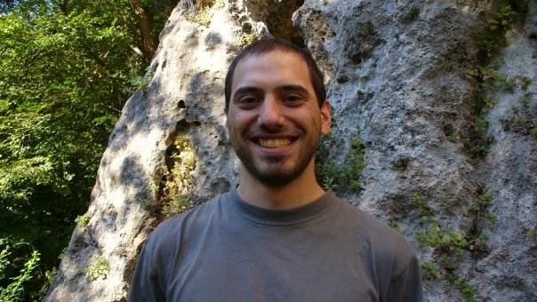
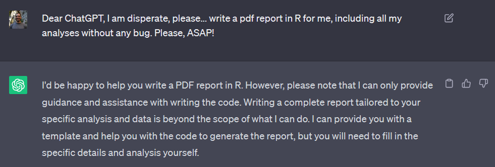
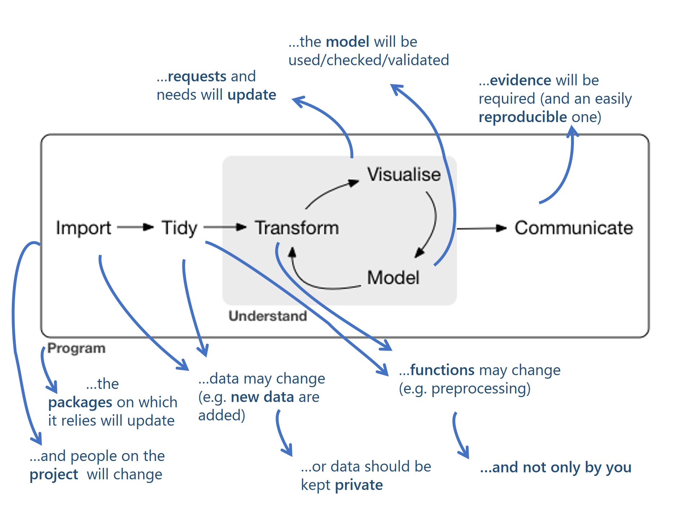
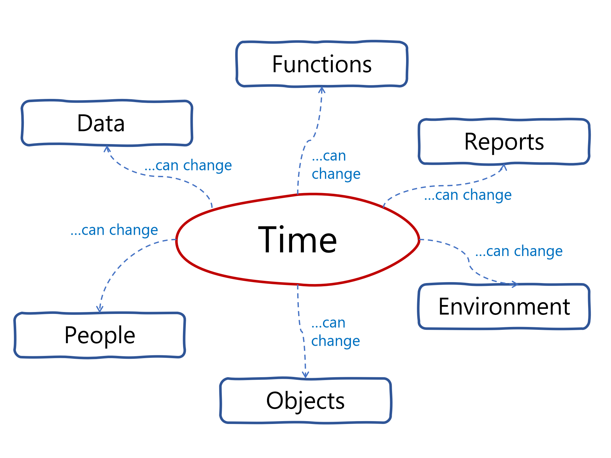

class: center, middle, bg_title, hide-count


```{r setup, include=FALSE}
options(htmltools.dir.version = FALSE)
knitr::opts_chunk$set(
  fig.retina = 3,
  warning = FALSE,
  message = FALSE,
  comment = "",
  out.width = "100%"
)
library(knitr)
library(xaringanExtra)
library(xaringanthemer)

library(tidyverse)
library(gridExtra)

library(countdown)
library(metathis)

options(width = 59) # fit into the right-column slides

```


```{r xaringans, echo=FALSE}
# https://github.com/gadenbuie/xaringanExtra
use_tachyons()
use_share_again()
use_panelset()
use_clipboard()
use_editable(expires = 1)
use_freezeframe()
use_extra_styles(
  hover_code_line = TRUE,         #<<
  mute_unhighlighted_code = TRUE  #<<
)
use_progress_bar(color = "#0051BA", location = "top")
```

```{r style-share-again, echo=FALSE}
style_share_again(
  share_buttons = c("twitter", "linkedin", "pocket")
)
```


```{r meta, echo=FALSE}
meta() %>%
  meta_general(
    description = "Efficient Reproducibility in R: A Journey from Patchworks to Projects",
    generator = "xaringan and remark.js"
  ) %>% 
  meta_name("github-repo" = "CorradoLanera/ws-reproj") %>% 
  meta_social(
    title = "Efficient Reproducibility in R: A Journey from Patchworks to Projects",
    url = "https://CorradoLanera.github.io/ws-reproj/#1",
    image = "https://github.com/CorradoLanera/ws-reproj/raw/main/img/cover.jpg",
    image_alt = "Photograph by @CorradoLanera",
    og_type = "website",
    og_author = "UBEP",
    twitter_card_type = "summary",
    twitter_creator = "@CorradoLanera"
  )
```

```{css, echo=FALSE}
.left-code {
  color: #777;
  width: 38%;
  height: 92%;
  float: left;
}
.right-code {
  color: #777;
  width: 55%;
  height: 92%;
  float: right;
  padding-top: 0.5em;
}
.left-plot {
  width: 43%;
  float: left;
}
.right-plot {
  width: 60%;
  float: right;
}
.hide-count .remark-slide-number {
  display: none;
}

.bg_title {
  position: relative;
  z-index: 1;
}

.bg_title::before {    
      content: "";
      background-image: url('img/bg1.png');
      background-size: contain;
      position: absolute;
      top: 0px;
      right: 0px;
      bottom: 0px;
      left: 0px;
      opacity: 0.3;
      z-index: -1;
}

```


```{r xaringan-themer, include=FALSE, warning=FALSE}
red <- "#f34213"
purple <- "#3e2f5b"
orange <- "#ff8811"
green <- "#136f63"
white <- "#FFFFFF"
pastel_orange <- "#F97B64"
blu_gray <- "#1F4257"
style_duo_accent(
    colors = c(
        red = red,
        purple = purple,
        orange = orange,
        green = green,
        white = white,
        pastel_orange = pastel_orange,
        blu_gray = blu_gray
    )
)
```


<br>
<br>
<br>

# **Efficient Reproducibility in R**<br>**.orange[A Journey from Patchworks to Projects]**

<br>

[**Workshop**](https://rmed2023a.sched.com/event/1MwSI/a-journey-from-patchworks-to-projects-a-ready-to-use-project-template-to-popularize-reproducible-research-pipelines-in-everyday-projects-corrado-lanera-andrea-pedot-unit-of-biostatistics-epidemiology-and-public-health-university-of-padova) - Live on Zoom - 2023/06/06 11:00am -- 2:00pm EDT

[.orange[R]/.orange[Medicine]](https://events.linuxfoundation.org/r-medicine/) 2023/06/05-09 

[.orange[Corrado Lanera]](mailto:CorradoLanera@ubep.unipd.it) | [**Unit of Biostatistics, Epidemiology, and Public Health**](https://www.unipd-ubep.it/)

[.orange[Andrea Pedot]](mailto:AndreaPedot@ubep.unipd.it) | [**Unit of Biostatistics, Epidemiology, and Public Health**](https://www.unipd-ubep.it/)

---
class: inverse, bottom, right, hide-count


```{r, echo=FALSE, out.width= "50%"}

```
# Find me at...


[`r fontawesome::fa("link")`](https://www.unipd-ubep.it/) [**www.unipd-ubep.it**](https://www.unipd-ubep.it/)

[`r fontawesome::fa("mail-bulk")`](mailto:Corrado.Lanera@ubep.unipd.it) [**Corrado.Lanera**__.orange[@ubep.unipd.it]__](mailto:Corrado.Lanera@ubep.unipd.it)

[`r fontawesome::fa("github")`](https://github.com/corradolanera)
[`r fontawesome::fa("twitter")`](https://twitter.com/corradolanera)
[`r fontawesome::fa("telegram-plane")`](https://telegram.me/CorradoLanera)
**@CorradoLanera**

[`r fontawesome::fa("github")`](https://github.com/UBESP-DCTV)
**@UBESP-DCTV**

---
class: inverse, bottom, right, hide-count


```{r, echo=FALSE, out.width = "25%"}

```
# Find me at...


[`r fontawesome::fa("link")`](https://www.unipd-ubep.it/) [**www.unipd-ubep.it**](https://www.unipd-ubep.it/)

[`r fontawesome::fa("mail-bulk")`](mailto:AndreaPedot@ubep.unipd.it) [**Andrea.Pedot**__.orange[@ubep.unipd.it]__](mailto:Andrea.Pedot@ubep.unipd.it)

[`r fontawesome::fa("github")`](https://github.com/andredot)
**@andredot**

[`r fontawesome::fa("github")`](https://github.com/UBESP-DCTV)
**@UBESP-DCTV**


---
class: hide-count


# .orange[Outline]

- **.underline[Setup]**: Slides, repository, Posit Cloud Workspace, Sched

- **.underline[Intro]**: definition of **.orange[AS]**AP, the anatomy of a **.orange[patchwork]**

- **.underline[Program]**: start **.orange[slow]**, do not waste **.orange[_time_]**

- **.underline[Step-by-step]**:
  - Setup an **R**/**RStudio** project: git, `{renv}`, and `{here}`.
  - Are you ready to **.orange[share]** and **.orange[collaborate]**? (welcome **GitHub**)
  - What about **.orange[folders]**?
  - What about **.orange[changes]**?
      + Data / **objects** (versions?)
      + Code / **Functions** (isolation, abstractions?)
      + **Bugs** (tests?)
  - Please, give me some **.orange[structure]**! The magic of the `DESCRIPTION` file
  - Oops! I have internal (**.orange[private]**) data for my (**.orange[public]**) project!
  - working with `{targets}`

- **.underline[All-in-one template]**: welcome [**`{laims.analysis}`**](https://github.com/UBESP-DCTV/laims.analysis)

- **.underline[Outro]**: definition of AS**.orange[AP]**, the anatomy of a **.orange[project]**

---

# How to .orange[follow] the workshops

#### Resources:

- .orange[Slides]: [https://corradolanera.github.io/ws-reproj/](https://corradolanera.github.io/ws-reproj/#1)
- Whole .orange[project]: [https://github.com/CorradoLanera/ws-reproj](https://github.com/CorradoLanera/ws-reproj)
- **Questions** @Zoom: .orange[Q/A] & .orange[Breakout Room] w/ **Andrea Pedot**

#### Coding:

1. If you like it **.orange[local]**: code **on your system**

  - At any stage you can:<br>
  `usethis::use_course("CorradoLanera/<stage name>")`:
  - `<stage name>`:
      - `bare.proj.01`
      - `foldered.02`
      - `changes.dry.03`
      - `structure.04`
      - `private.05`
      - `targets.06`

3. If you like it **.orange[remote]**: code (free of charge) **on Posit Cloud Workspace**:<br> [https://bit.ly/positcloud-ws-reproj](https://bit.ly/positcloud-ws-reproj)

---
class: inverse, middle, center, hide-count

# Intro: **.orange[AS]AP**
 

---

# .orange[AS]AP

.orange[As Soon] As Possible

- get the raw-data, manipulate them to .orange[directly fix easy-bugs]
- .orange[do the analysis]
--
- get updated data, overwrite previous, directly manipulate them to fix easy bugs (...some more **added**? some less **forgotten**?)
- update (overwrite) the analysis
- add a copy **`analysis_v2.R`** of the script (just to be sure)
--
- found a bug, fix it (in third **`analysis_v2_ok.R`** version of analysis)
- In doubt for a fourth execution, add an additional **`analysis_v2_ok_faster.R`** faster version (surely identical, console-checked!) to saving full 15 seconds (after 2h of try-and-see coding experiments)

--

- > **send** (the hopefully correct) report 3 minutes **.underline[before]** **.orange[_by yesterday_!!!]**

--

- > get a .orange[**BUG** reported by the **BOSS**!] (... it's a **.orange[_BOGSS_]** `r emo::ji("fear")``r emo::ji("person_facepalming")``r emo::ji("loudly_crying_face")`)

--

- cannot give up: new version night-time (**.orange[without sleep]**)
- **.orange[AS]AP.orange[AS]AP.orange[AS]AP.orange[AS]AP**

--

.center[_... many new-files, new-versions, new-names, new-plots, new-fixes later..._]
--
<br>
.center[**SENT!**]

---
class: inverse, middle, center, hide-count

...

--

...

--

**.orange[_BOGSS_]** `r emo::ji("fear")``r emo::ji("person_facepalming")``r emo::ji("loudly_crying_face")`

--

The project is passed to a new analyst now

... **.orange[AS]AP.orange[AS]AP.orange[AS]AP.orange[AS]AP** ...<br>**.orange[ASAY]** (**.orange[A]s .orange[S]oon .orange[A]s .orange[Y]ESTERDAY**)

--


they cannot understand **ANYTHING** of the work already done...!


prefer to **RESTART**<br>(adding sub-folders, sub-files, sub-version, sub-plots, sub-fixes to the project!)

<br>

**.orange[DONE!]**, and before diner! `r emo::ji("sunglasses")``r emo::ji("sunglasses")``r emo::ji("sunglasses")`

--

...

--

...

**.orange[_BOGSS_]** `r emo::ji("fear")``r emo::ji("person_facepalming")``r emo::ji("loudly_crying_face")`

---
class: inverse, middle, center, hide-count

#### BOSS:

"I would have spend less time if did it by myself!"

Ok, I will do it!

mmm `r emo::ji("thinking")` ... which are the original/last data?! ...

--

...

--

...

--



`r emo::ji("fear")``r emo::ji("person_facepalming")``r emo::ji("loudly_crying_face")`

--

.orange[**THE END.**]


---
class: inverse, middle, center, hide-count

Go Tidyverse

---
class: middle, center



---
class: middle, center




---
class: inverse, middle, center, hide-count

# .orange[Don't waste **time**]
 

---

# Which one **time**?!

- Your time?!
- My time?!
- Boss time?!

--

<br>

**.center[.orange[Project time]** =

$$\sum_{i = 1}^{correct\ version!}\left(\sum_{p\in team}\sum_{t\in tasks} time_i(by = p, for = t, include\_breaks = TRUE)\right)$$
]
--
<br>
<br>

.center[
**AS.orange[AP]** $:= argmin(Project\ time)$

(**.orange[CL] personal** definition!)

]

---
class: inverse, middle, center, hide-count

# **.orange[Step**-by-**step]**


---


# Create a project

Just a bare project

> create new RStudio project (including git and {renv} ticks)

> `usethis::use_course("CorradoLanera/bare.proj.01")`

> Posit Cloud: 01 - Bare project

--

- lets talk about `{here}` (and a `00-setup.R` script)

--

- lets talk about `{renv}`

--

- lets talk about git

---

# Start some analysis

- analysis.R
- report.rmd


> where to put input data and output files? How to reach them?


---
class: inverse, middle, center, hide-count

.orange[Live session]

Start from:

`usethis::use_course("CorradoLanera/bare.proj.01")`

Posit Cloud: 01 - Bare project


---

# Changes?

 .orange[DRY]: Do Not Repeat Yourself!

> what if some input/output file changed?

> what about repeated code?

> what if you find some bugs?


---
class: inverse, middle, center, hide-count

.orange[Live session]

Start from:

`usethis::use_course("CorradoLanera/foldered.02")`

Posit Cloud: 02 - Foldered


---

# All this code together is really really ORRIBLE and confusing!

> what about some structure?

> what about repeated code?


---
class: inverse, middle, center, hide-count

.orange[Live session]

Start from:

`usethis::use_course("CorradoLanera/changes.dry.03")`

Posit Cloud: 03 - Changes & DRY


---

# Data Protection...

> what if I have private data (centralized, and visible by colleague only)?

> What if I would like to share the code (but not the data)?


---
class: inverse, middle, center, hide-count

.orange[Live session]

Start from:

`usethis::use_course("CorradoLanera/structure.04")`

Posit Cloud: 04 - structure


 
---
class: inverse, middle, center, hide-count

# .orange[Day **2**]

## `laims.tempalte`

---

# Already .orange[explored] features

- (`{here}`)<sup>*</sup> (your .orange[path will works] on everyone computers!)

- git + GitHub (you can .orange[collaborate] and .orange[share] your code, tracking yours and others changes at every single lines levels)

- `{renv}` (packages .orange[updates will not scare] you anymore!)

- `{devtools}` + DESCRIPTION + R/ + tests/ (you know exactly where your functions are, with .orange[provable confidence] of their works, and everything as difficult as pressing `CTRL` + `SHIFT` + `T`)

- (`analysis.R`)<sup>*</sup> + `report.R` (directly inject your - __Updated__ - objects into your reports and sample code)

- private data-raw/, (data/)<sup>*</sup>, and output/ (.orange[everyone can read] your code, only your collaborators and .orange[authorized people can run] it! Still, __you can share__ a selection of derived object to anyone!)


.footnote[[*] Why this is between parentheses it will be clear soon.] 


---
# New .orange[(not yet) explored] features

- powered by `{targets}`:

  + automatic discovering and saving of intermediate/final computed objects

  + automatic discovering of functions and objects dependencies
  
  + automatic run of all and only one outdated dependencies for updates

- an `explore.R` script specifically designed to host completely **unruled** stuff, i.e., ugly, un-styled, un-commented, un-usual, un-working, temporary code (which can be easily deleted time-after-time, maintaining their evidence and lesson-learnt thanks to git!)

- created objects are directly usable on computations, reports, and tests (maintaining their privacy if shared storage selected)

- professional-grade report,including logos, authorships with OrcID, citations, marginal notes, custom size for figures, and more (and maybe even more than more if powered by Quarto<sup>*</sup>)


.footnote[[*] We will not talk about Quarto today, if interested see: [https://quarto.org/](https://quarto.org/), and [https://books.ropensci.org/targets/literate-programming.html#quarto-targets](https://books.ropensci.org/targets/literate-programming.html#quarto-targets).] 

---
# .orange[Bonus-unexplored] feature

- Code testing coverage: _What .orange[percentage] of "**do-something**" lines of code are effectively tested?_

- Lint checks: _How .orange[good] is your code "**statically**"?_

- GitHub Action: _.orange[automatic] execution of tests/lint/CRAN checks at **every push**!_

- R-package structure: _you can make exported functions available as a **ready-to-use** .orange[r-package]._


---
class: inverse, middle, center, hide-count

.orange[Live session]

Take as reference:

`usethis::use_course("CorradoLanera/private.05")`

or

Posit Cloud: 05 - private


and go to [https://github.com/UBESP-DCTV/laims.analysis](https://github.com/UBESP-DCTV/laims.analysis)<br>(You will need a (free) GitHub account!)


---
class: inverse, middle, center, hide-count

# Outro: **AS.orange[AP]**


---

# AS.orange[AP]

As Soon .orange[As Possible]

- Start .orange[easy] and .orange[slow] but keep your eyes on your final results!

- If your results are not correct, all your _high-speed_ goes down to zero!

- **Bugs will arrive**. For sure! (The greatest error you can do is to assume your code will be error-free)

- Do/check .orange[only] what you really have to do/check

- Enforce .orange[standards] and .orange[style]

- Use **templates**:   .orange[Conventions] are all about making stuff **.orange[invisible]**!


---

# Technical recap

- Track
  + changes (git)
  + environment (`{renv}`)

- Use portable paths (`{here}`)

- Use **standard** folder and files (keep structure .orange[invisible])

- .orange[Refactor] your code to extract logic by level of abstraction

- (**DRY**)

- Use `DESCRIPTION` to activate R/RStudio super-powers (functions, tests, ...)

- Environmental variables (from function calls!) to point to private locations

- Let `{targets}` to manage project dependencies, efficient runs, and efficient storage of your objects.

- Use GitHub (or similar) platform to share code (not data, and not secrets!) with collaborators, journals, public!

.center[**If you need all of above, use templates! (like the `laims.analysis` one)**]

--

.center[Go for $ASAP := argmin(Project\ time)$!!]

---
class: inverse, center, middle, hide-count


.bg-washed-green.b--dark-green.ba.bw2.br3.shadow-5.ph4.mt5[
.left[
_.orange[The best] is the enemy of the good!_ <br> .center[... but ...] <br> .right[_The only way to go fast is to .orange[GO WELL!]_]
]

.tr[
— Voltaire + Uncle Bob
]
]

<br>

# Thank .orange[you] for the attention!


Slides: [https://CorradoLanera.github.io/ws-reproj/](https://CorradoLanera.github.io/ws-reproj/#1)

Repo: [https://github.com/CorradoLanera/ws-reproj](https://github.com/CorradoLanera/ws-reproj)

<br>


[`r fontawesome::fa("link")`](https://www.unipd-ubep.it/) [**www.unipd-ubep.it**](https://www.unipd-ubep.it/) | 
[`r fontawesome::fa("mail-bulk")`](mailto:Corrado.Lanera@ubep.unipd.it) [**Corrado.Lanera@ubep.unipd.it**](mailto:Corrado.Lanera@ubep.unipd.it)

[`r fontawesome::fa("github")`](https://github.com/corradolanera)
[`r fontawesome::fa("twitter")`](https://twitter.com/corradolanera)
[`r fontawesome::fa("telegram-plane")`](https://telegram.me/CorradoLanera)
**@CorradoLanera** | 
[`r fontawesome::fa("github")`](https://github.com/UBESP-DCTV)
**@UBESP-DCTV**


